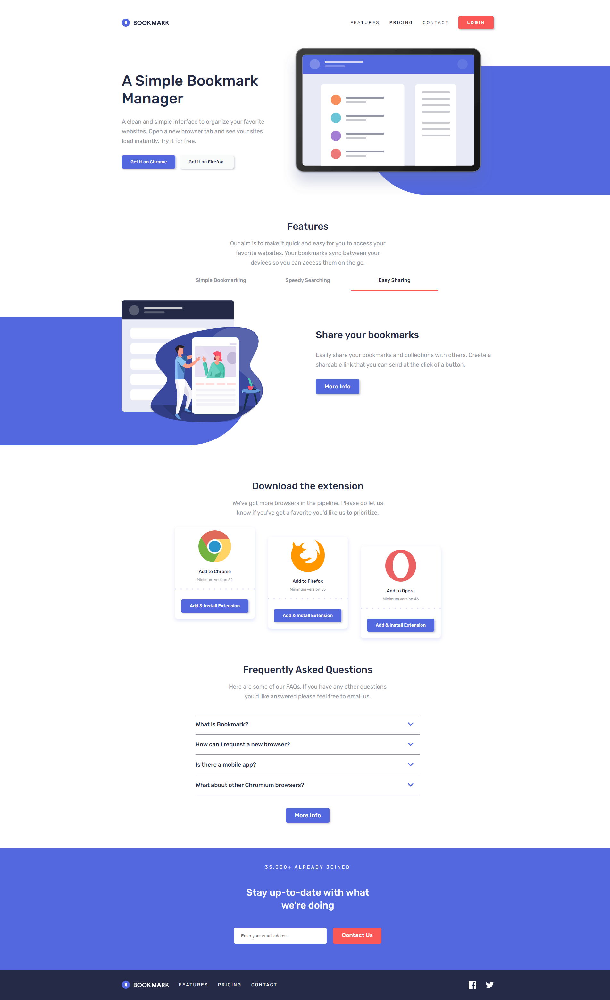
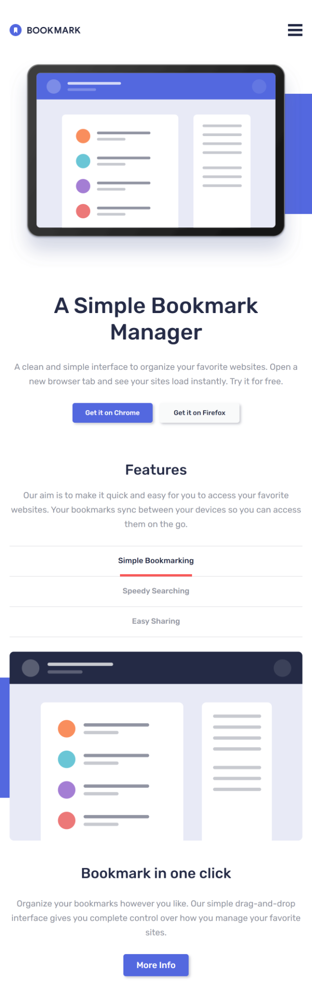
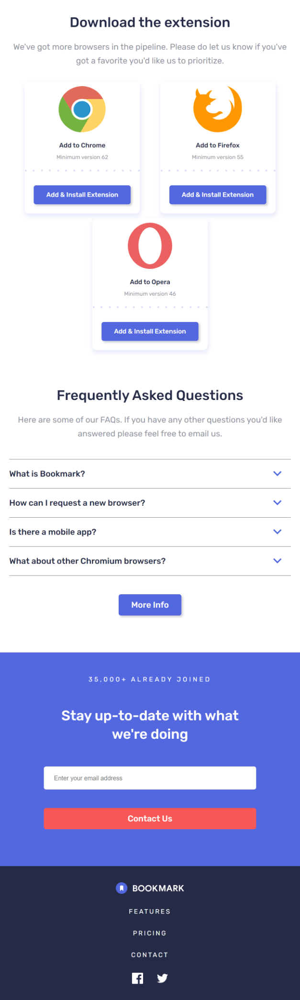

# Frontend Mentor - Bookmark landing page solution

This is a solution to the [Bookmark landing page challenge on Frontend Mentor](https://www.frontendmentor.io/challenges/bookmark-landing-page-5d0b588a9edda32581d29158). Frontend Mentor challenges help you improve your coding skills by building realistic projects. 

## Table of contents

- [Overview](#overview)
  - [The challenge](#the-challenge)
  - [Screenshot](#screenshot)
  - [Links](#links)
- [My process](#my-process)
  - [Built with](#built-with)
  - [Useful resources](#useful-resources)
- [Author](#author)

## Overview

### The challenge

Users should be able to:

- View the optimal layout for the site depending on their device's screen size
- See hover states for all interactive elements on the page
- Receive an error message when the newsletter form is submitted if:
  - The input field is empty
  - The email address is not formatted correctly

### Screenshot

    <h5>Desktop: </h5>
    

    <h5>Mobile: </h5>
    
    

### Links

- Solution URL: [https://www.frontendmentor.io/solutions/responsive-landing-page-using-react-sass-css-grid-and-flexbox-GNUky5PXNy](https://www.frontendmentor.io/solutions/responsive-landing-page-using-react-sass-css-grid-and-flexbox-GNUky5PXNy)
- Live Site URL: [https://nicoleyry-bookmark-landing-page.netlify.app/](https://nicoleyry-bookmark-landing-page.netlify.app/)

## My process

### Built with

- Semantic HTML5 markup
- CSS custom properties
- Flexbox
- CSS Grid
- Mobile-first workflow
- [React](https://reactjs.org/) - JS library
- [SASS](https://sass-lang.com/) - For styles

### Useful resources

- [How to Build an Accordion Menu in React from Scratch](https://www.freecodecamp.org/news/build-accordion-menu-in-react-without-external-libraries/)

## Author

- Website - [Nicole Yang](https://www.nicoleyry.com/)
- Frontend Mentor - [@nicoleyry](https://www.frontendmentor.io/profile/nicoleyry)
- Twitter - [@nicoleyry](https://twitter.com/nicoleyry)
